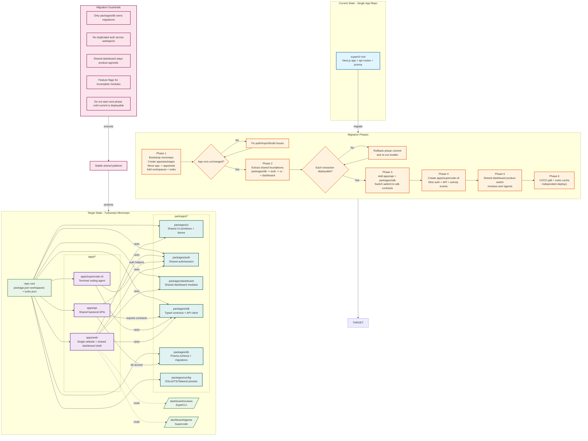

# SuperCLI -> Monorepo Migration Diagram (Excalidraw-ready)

## Key Architecture Points

- **Single Web App**: One shared web app (`apps/web`) with route-based product areas (`/dashboard/reviews` for SuperCLI, `/dashboard/agents` for Supercode)
- **Contract Center**: `apps/api` and `packages/sdk` become the contract hub for both web and CLI
- **Shared Foundation**: Auth, DB, UI, dashboard shell, and config move to packages
- **Phased Migration**: Each phase is validated and deployable before proceeding
- **Guardrails**: Strict rules prevent common monorepo pitfalls

## Migration Safety Net

The diagram shows how each phase has validation gates and rollback options, ensuring the migration can proceed safely without breaking the existing application.