# SuperCLI → Turborepo Monorepo — Excalidraw-ready Mermaid

Use these Mermaid snippets in Excalidraw (Mermaid plugin) or any Mermaid renderer. Each diagram stays within ~15–20 nodes and follows the diagram rule style.

---

## 1. Monorepo Folder Structure (Directory Tree)

---

## 2. Monorepo Structure (Compact Tree)

```mermaid
flowchart TB
  subgraph Root["supercli/"]
    direction TB
    R1["package.json · turbo.json"]
  end

  subgraph Apps["apps/"]
    WEB["web/"]
    API["api/"]
    CLI["supercode-cli/"]
  end

  subgraph Packages["packages/"]
    UI["ui/"]
    AUTH["auth/"]
    DB["db/"]
    SDK["sdk/"]
    DASH["dashboard/"]
    CFG["config/"]
  end

  Root --> Apps
  Root --> Packages
```

---

## 3. Target Monorepo Architecture

```mermaid
flowchart LR
  subgraph Current["Current State — Single App Repo"]
    CURR["supercli root\nNext.js app + api routes + prisma"]
  end

  CURR ==> ROOT

  subgraph Target["Target State — Turborepo Monorepo"]
    ROOT["repo root\npackage.json workspaces + turbo.json"]

    subgraph Apps["apps/*"]
      WEB["apps/web\nWebsite + shared dashboard shell"]
      API["apps/api\nShared backend APIs"]
      CLI["apps/supercode-cli\nTerminal coding agent"]
    end

    subgraph Packages["packages/*"]
      UI["packages/ui\nShared UI + theme"]
      AUTH["packages/auth\nAuth/session"]
      DB["packages/db\nPrisma schema + migrations"]
      SDK["packages/sdk\nTyped contracts + API client"]
      DASH["packages/dashboard\nShared dashboard modules"]
      CFG["packages/config\nESLint/TS/Tailwind presets"]
    end

    WEB -->|uses| UI
    WEB -->|uses| AUTH
    WEB -->|uses| DASH
    WEB -->|uses| SDK

    CLI -->|uses| SDK
    CLI -.->|auth helpers| AUTH

    API -->|uses| AUTH
    API -->|db access| DB
    API -.->|exports contracts| SDK

    ROOT --> WEB
    ROOT --> API
    ROOT --> CLI
    ROOT --> UI
    ROOT --> AUTH
    ROOT --> DB
    ROOT --> SDK
    ROOT --> DASH
    ROOT --> CFG
  end
```

---

## 4. App → Package Dependencies (Simplified)

---

## 5. Phased Execution Flow

```mermaid
flowchart TD
  P1["Phase 1\nBootstrap monorepo\napps/web + workspaces + turbo"] --> G1{App runs unchanged?}
  G1 -->|No| F1[Fix path/import/build issues]
  F1 --> G1
  G1 -->|Yes| P2

  P2["Phase 2\nExtract packages\ndb → auth → ui → dashboard"] --> G2{Each deployable?}
  G2 -->|No| F2[Rollback and re-cut smaller]
  F2 --> G2
  G2 -->|Yes| P3

  P3["Phase 3\napps/api + packages/sdk\nWeb/CLI use SDK contracts"] --> P4
  P4["Phase 4\napps/supercode-cli\nAuth + API + activity events"] --> P5
  P5["Phase 5\nShared dashboard product switch\n/reviews and /agents"] --> P6
  P6["Phase 6\nCI/CD split + turbo cache\nIndependent deploys"]
```

---

## 6. Guardrails → Stable Platform

---

## 7. Route Map (Web App)

---

## Diagram key (per rule)

- `-->` — main dependency/flow  
- `-.->` — optional or secondary (e.g. auth helpers, route mapping)  
- `==>` — critical path (e.g. migration, DB ownership)  
- Subgraphs group: Current vs Target, Apps vs Packages, Phases, Guardrails  

**After generating:** Use diagram 1–2 for monorepo folder structure, 3 for full architecture, 4 for dependency overview, 5 for migration plan, 6 for guardrails, 7 for routes. In Excalidraw, paste one Mermaid block at a time into the Mermaid plugin for best layout.
