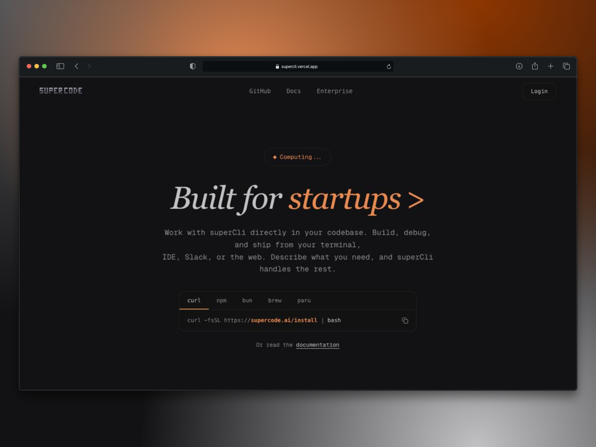

<div align="center">
  
  # Supercode
  
  **CLI AI Coding Agent for developers**
  
  Work with superCli directly in your codebase. Build, debug, and ship from your terminal, IDE, Slack, or the web. Describe what you need, and superCli handles the rest.
  
  [](https://supercli.vercel.app)

  

</div>

---

## 🚀 Features

- **Multi-platform Support**: Work from terminal, IDE, Slack, or web interface
- **AI-Powered**: Intelligent code generation and assistance
- **Direct Codebase Integration**: Seamlessly work within your existing projects
- **Build, Debug & Ship**: Complete development workflow support
- **Natural Language Interface**: Describe what you need in plain English

## 📦 Installation

### Using curl (Recommended)
```bash
curl -fsSL https://supercode.ai/install | bash
```

### Using npm
```bash
npm install -g supercode
```

### Using bun
```bash
bun install -g supercode
```

### Using Homebrew
```bash
brew install supercode
```

### Using paru (Arch Linux)
```bash
paru -S supercode
```

## 🛠️ Getting Started

### Prerequisites

- Node.js 18+ or Bun
- PostgreSQL database
- Git

### Development Setup

1. **Clone the repository**
   ```bash
   git clone git@github.com:yashdev9274/supercli.git
   cd supercli
   ```

2. **Install dependencies**
   ```bash
   bun install
   ```

3. **Set up environment variables**
   ```bash
   cp .env.example .env
   # Edit .env with your configuration
   ```

4. **Set up the database**
   ```bash
   bunx prisma migrate dev
   bunx prisma generate
   ```

5. **Run the development server**
   ```bash
   bun run dev
   ```

6. **Open your browser**
   Navigate to [http://localhost:3000](http://localhost:3000) to see the application.

## 🏗️ Tech Stack

- **Framework**: Next.js 16.1.1
- **Language**: TypeScript
- **Database**: PostgreSQL with Prisma
- **Vector Database**: Pinecone
- **Authentication**: Better Auth
- **UI Components**: Radix UI + Tailwind CSS
- **State Management**: TanStack Query
- **Styling**: Tailwind CSS v4

## 📚 Project Structure

```
supercli/
├── app/                    # Next.js app directory
│   ├── (auth)/            # Authentication routes
│   ├── api/               # API routes
│   ├── dashboard/         # Dashboard pages
│   └── layout.tsx         # Root layout
├── components/            # React components
│   ├── dashboard/         # Dashboard components
│   ├── homepage/          # Homepage components
│   ├── providers/         # Context providers
│   └── ui/                # UI component library
├── lib/                   # Utility libraries
├── modules/               # Feature modules
├── prisma/                # Database schema and migrations
└── public/                # Static assets
```

## 🔧 Available Scripts

- `bun dev` - Start development server
- `bun build` - Build for production (includes Prisma generate)
- `bun start` - Start production server
- `bun lint` - Run ESLint

## 📄 License

Right now this project is private and proprietary.

---

<div align="center">
  Made with ❤️ by the Supercode team
</div>
