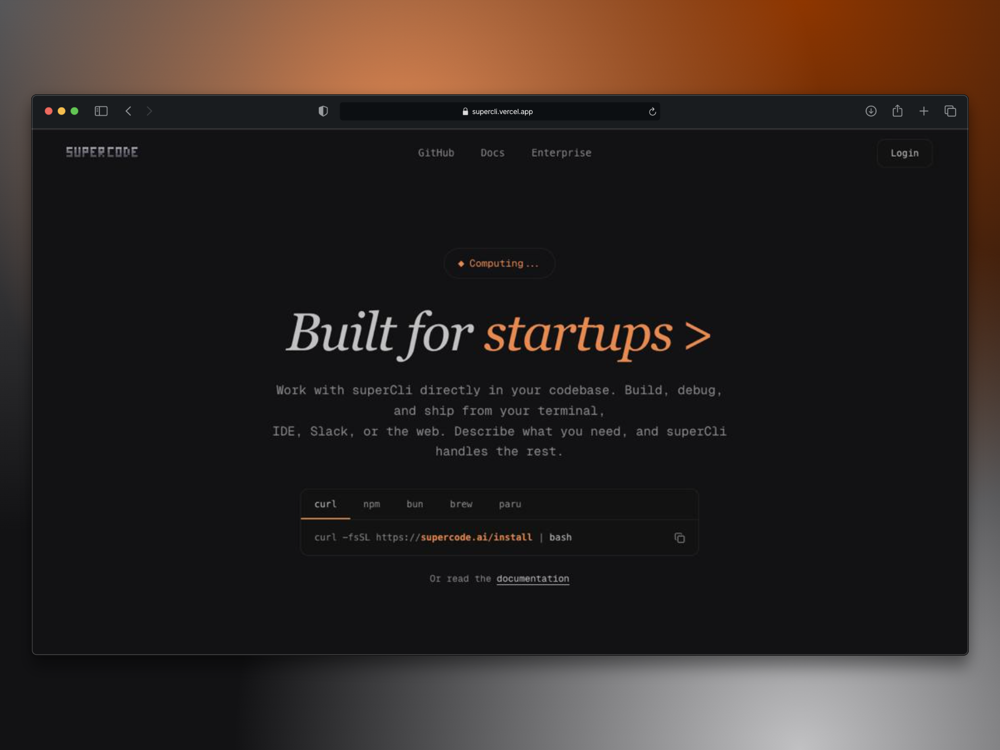

<div align="center">
  
  # Supercode
  
  **AI-Powered Terminal Coding Agent**
  
  A monorepo containing the Supercode dashboard, documentation, terminal AI client, and shared packages.
  
  [](https://supercli.vercel.app)
  [](https://bun.sh)
  [](https://turbo.build)
  [](https://www.typescriptlang.org/)

  

</div>

---

## Overview

Supercode is a full-stack AI-powered development platform built as a monorepo using Turborepo. It provides:

- **Dashboard** - Web interface for managing repositories, viewing analytics, and GitHub OAuth integration
- **Documentation** - MDX-based documentation site
- **Terminal Client** - AI-powered terminal coding assistant (in development)
- **Video Generation** - Remotion-based video creation tools
- **Open Model** - Fine-tuning open-source LLMs (Qwen3, GLM-4) for coding tasks

## Architecture

This is a **monorepo** managed with [Turborepo](https://turbo.build), containing multiple applications and shared packages.

### Applications

| App | Description | Port |
|-----|-------------|------|
| `apps/web` | Next.js dashboard application | 3000 |
| `apps/docs` | MDX documentation site | 3001 |
| `apps/supercode-cli/client` | Terminal AI web client | TBD |
| `apps/supercode-cli/server` | Terminal WebSocket server | TBD |
| `apps/api` | API server (scaffolded) | TBD |
| `apps/video` | Remotion video generation | - |

### Packages

| Package | Description |
|---------|-------------|
| `@super/db` | Prisma database client and schema |
| `@super/auth` | Better-Auth configuration (server & client) |
| `@super/ui` | Shared UI components |
| `@super/sdk` | SDK package |
| `@super/config` | Shared configuration |
| `@super/dashboard` | Dashboard components |

## Supercode Open Model 🧠

We're building a **coding-focused LLM** by fine-tuning open-source models for the Supercode Terminal. This project runs in parallel with the main platform.

### Goal

Fine-tune open models to create an AI assistant specialized in:
- Code generation and completion
- Debugging and error fixing
- Code explanation and documentation
- Multi-language programming support

### Training Strategy

We're using a **dual-track approach** to train two models simultaneously:

| Track | Infrastructure | Model | Method | Estimated Cost |
|-------|---------------|-------|--------|----------------|
| **Track 1** | [Tinker](https://thinkingmachines.ai/tinker/) (Managed) | Qwen3-8B | LoRA | $150 free credits |
| **Track 2** | [Modal](https://modal.com) + Axolotl | GLM-4-9B | LoRA/QLoRA | ~$15-20 |

### Training Pipeline

```
┌─────────────────────────────────────────────────────────────────┐
│                  PARALLEL TRAINING TRACKS                       │
├─────────────────────────────────────────────────────────────────┤
│                                                                 │
│  Track 1: Tinker + Qwen3        Track 2: Modal + GLM-4         │
│                                                                 │
│  Setup → Dataset → Fine-tune → Evaluate → Compare → Deploy     │
│                                                                 │
└─────────────────────────────────────────────────────────────────┘
```

### Project Structure

```
supercode-openmodel/
├── training/
│   ├── data/                    # Dataset preparation scripts
│   ├── tinker_qwen3/            # Tinker + Qwen3 training code
│   └── evaluation/              # Model evaluation scripts
├── models/                      # Model checkpoints
├── config/                      # Training configurations
└── supercode-openmodel.md       # Detailed training guide
```

### Training Datasets

We use high-quality coding datasets:

| Dataset | Size | Purpose |
|---------|------|---------|
| [CodeAlpaca](https://huggingface.co/datasets/HuggingFaceH4/CodeAlpaca_20K) | 20K | Instruction tuning |
| [OpenCodeReasoning](https://huggingface.co/datasets/nvidia/OpenCodeReasoning) | 100K+ | Reasoning + coding |
| [CodeFeedback](https://huggingface.co/datasets/m-a-p/CodeFeedback-Filtered-Instruction) | 156K | Instruction-response |

### Quick Start

1. **Set up Tinker (Track 1)**
   ```bash
   pip install tinker
   export TINKER_API_KEY="your-key"
   cd supercode-openmodel/training/tinker_qwen3
   python train.py
   ```

2. **Set up Modal (Track 2)**
   ```bash
   pip install modal
   modal token new
   # Configure HuggingFace token in Modal secrets
   modal run --detach src.train --config=config/glm4.yml
   ```

### Documentation

For detailed setup instructions, dataset preparation, and evaluation metrics, see:
- **[supercode-openmodel.md](./supercode-openmodel.md)** - Complete training guide with code examples

### Current Status

🚧 **In Progress** - Actively training and evaluating models. The best-performing model will be deployed to the Supercode Terminal app.

---

## Tech Stack

### Framework & Runtime
- **Next.js 16** - React framework with App Router
- **React 19** - UI library
- **TypeScript 5** - Type safety
- **Bun** - JavaScript runtime & package manager

### Monorepo
- **Turborepo** - Build system for monorepos

### Database & ORM
- **PostgreSQL** - Primary database
- **Prisma 7** - Database ORM
- **Pinecone** - Vector database

### Authentication
- **Better Auth** - Authentication system
- **GitHub OAuth** - Social login

### UI & Styling
- **Tailwind CSS v4** - Utility-first CSS
- **Radix UI** - Component primitives
- **Framer Motion** - Animations
- **Lucide Icons** - Icon library

### State & Data
- **TanStack Query** - Server state management
- **React Hook Form** - Form handling
- **Zod** - Schema validation

### AI & ML
- **Google Gemini** - AI model (embeddings)
- **AI SDK** - AI integration

## Getting Started

### Prerequisites

- **Bun** 1.2+ ([Install](https://bun.sh))
- **PostgreSQL** database ([Neon](https://neon.tech), [Supabase](https://supabase.com), or local)
- **Git**

### Installation

1. **Clone the repository**
   ```bash
   git clone https://github.com/yashdev9274/supercli.git
   cd supercli
   ```

2. **Install dependencies**
   ```bash
   bun install
   ```

3. **Set up environment variables**
   ```bash
   cp .env.example .env
   ```
   
   Edit `.env` with your configuration. Required variables:
   ```env
   DATABASE_URL="postgresql://..."
   BETTER_AUTH_SECRET="your-secret-key"
   BETTER_AUTH_URL="http://localhost:3000"
   GITHUB_CLIENT_ID="your-github-oauth-id"
   GITHUB_CLIENT_SECRET="your-github-oauth-secret"
   ```

4. **Set up the database**
   ```bash
   cd packages/db
   bunx prisma migrate dev
   bun run db:generate
   cd ../..
   ```

5. **Start development servers**
   ```bash
   # Start all apps
   bun run dev
   
   # Or start specific apps
   bun run dev:web      # Dashboard on port 3000
   bun run dev:docs     # Docs on port 3001
   bun run dev:terminal # Terminal client
   ```

6. **Open your browser**
   - Dashboard: [http://localhost:3000](http://localhost:3000)
   - Documentation: [http://localhost:3001](http://localhost:3001)

### GitHub OAuth Setup

1. Go to [GitHub Developer Settings](https://github.com/settings/developers)
2. Create a new OAuth App
3. Set Authorization callback URL: `http://localhost:3000/api/auth/callback/github`
4. Copy Client ID and Client Secret to your `.env` file

## Project Structure

```
supercli/
├── apps/
│   ├── web/                 # Dashboard application
│   │   ├── app/             # Next.js App Router
│   │   │   ├── (auth)/      # Auth pages
│   │   │   ├── dashboard/   # Dashboard pages
│   │   │   └── api/         # API routes
│   │   ├── components/      # React components
│   │   ├── lib/             # Utilities
│   │   └── modules/         # Feature modules
│   │
│   ├── docs/                # Documentation site
│   │   ├── app/             # Next.js App Router
│   │   └── content/         # MDX content
│   │
│   ├── supercode-cli/       # Terminal AI app
│   │   ├── client/          # Web client
│   │   └── server/          # WebSocket server
│   │
│   ├── api/                 # API server
│   └── video/               # Video generation #optional
│
├── packages/
│   ├── db/                  # Prisma client
│   │   └── prisma/
│   │       └── schema.prisma
│   │
│   ├── auth/                # Better-Auth config
│   │   ├── server.ts
│   │   └── client.ts
│   │
│   ├── ui/                  # Shared UI
│   ├── sdk/                 # SDK
│   ├── config/              # Config
│   └── dashboard/           # Dashboard components
│
├── supercode-openmodel/     # LLM fine-tuning project
│   ├── training/            # Training scripts
│   ├── models/              # Model checkpoints
│   ├── config/              # Training configs
│   └── supercode-openmodel.md  # Training guide
│
├── turbo.json               # Turborepo config
├── package.json             # Root package
├── .env.example             # Environment template
├── CONTRIBUTING.md          # Contribution guide
└── README.md                # This file
```

## Available Scripts

### Development

```bash
bun run dev              # Start all apps
bun run dev:web          # Dashboard only (port 3000)
bun run dev:docs         # Docs only (port 3001)
bun run dev:terminal     # Terminal client only
bun run dev:api          # API server only
```

### Build & Quality

```bash
bun run build            # Build all apps and packages
bun run lint             # Run ESLint across all packages
bun run typecheck        # Run TypeScript checks
```

### Database

```bash
cd packages/db
bun run db:generate      # Generate Prisma client
bun run db:migrate       # Deploy migrations
bunx prisma studio       # Open Prisma Studio
bunx prisma migrate dev --name migration_name  # Create migration
```

### Video Generation

```bash
bun run dev:video        # Start Remotion studio
bun run build:video      # Build video
bun run build:video:square    # Square format
bun run build:video:vertical  # Vertical format
```

## Environment Variables

See `.env.example` for all available environment variables.

### Required

| Variable | Description |
|----------|-------------|
| `DATABASE_URL` | PostgreSQL connection string |
| `BETTER_AUTH_SECRET` | Session encryption secret |
| `BETTER_AUTH_URL` | Base URL (http://localhost:3000) |
| `GITHUB_CLIENT_ID` | GitHub OAuth app client ID |
| `GITHUB_CLIENT_SECRET` | GitHub OAuth app secret |

### Optional

| Variable | Description |
|----------|-------------|
| `GOOGLE_GEMINI_API_KEY` | Google Gemini AI API key |
| `PINECONE_DB_API_KEY` | Pinecone vector database key |
| `HUGGING_FACE_TOKEN` | Hugging Face API token |
| `TINKER_API_KEY` | Tinker API key for LLM fine-tuning |

## Contributing

We welcome contributions! Please see our [Contributing Guide](./CONTRIBUTING.md) for details on:

- Development setup
- Code style guidelines
- Commit conventions
- Pull request process

## License

This project is currently private and proprietary.

---

<div align="center">
  <strong>Built with ❤️ by the Supercode team!</strong>
</div>
