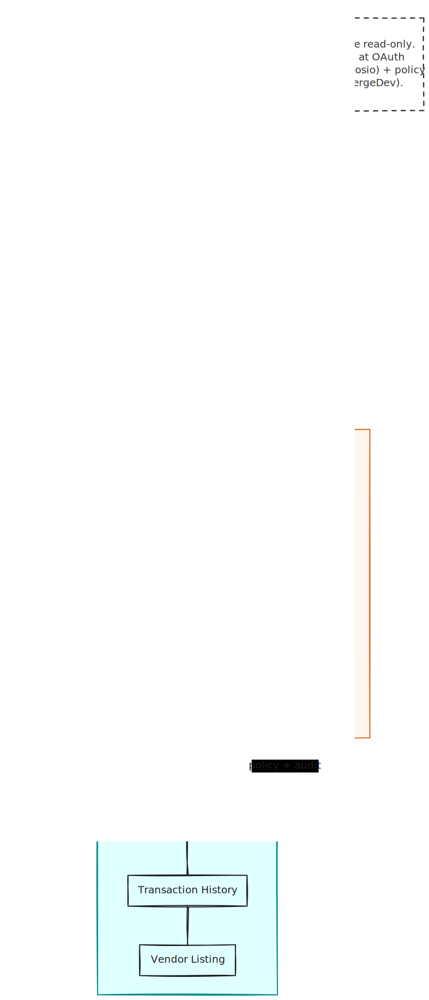

# Mercury MCP Integration — Security & Architecture Guide

## 0. Structural diagram



## 1. End-to-End Architecture

```
┌─────────────────────────────────────────────────────────────────────┐
│                        SUPERCODE USER                               │
│  (CLI or Web dashboard)                                             │
└────────────────────────────┬────────────────────────────────────────┘
                             │  Authenticated session
                             ▼
┌─────────────────────────────────────────────────────────────────────┐
│                    MCP MANAGER (McpManager)                         │
│  • HTTP/SSE transport to Composio MCP gateway                       │
│  • HTTP/SSE transport to MergeDev connector gateway                 │
│  • Prefixes tools as mcp_composio_* and mcp_mergedev_*              │
│  • All tool invocations gated by PermissionManager.check()          │
└────────────────────────────┬────────────────────────────────────────┘
                             │
                             │  Parallel gateways
                             │
              ┌──────────────┴──────────────┐
              │                             │
              ▼                             ▼
┌──────────────────────────────┐  ┌──────────────────────────────┐
│       COMPOSIO GATEWAY       │  │       MERGEDEV GATEWAY       │
│                              │  │                              │
│  • OAuth flow & session      │  │  • Connector governance      │
│  • Token storage/refresh     │  │  • Policy enforcement        │
│  • Connected account mgmt    │  │  • Per-call audit logs       │
│  • Mercury API proxy         │  │  • Rate limiting             │
│                              │  │  • Scoped tool access        │
└──────────────┬───────────────┘  └──────────────┬───────────────┘
               │                                  │
               └────────────────┬─────────────────┘
                                │
                                ▼
┌─────────────────────────────────────────────────────────────────────┐
│                          MERCURY API                                 │
│         Read-only: Balances · Transactions · Vendors                │
└─────────────────────────────────────────────────────────────────────┘
```

### How the Parallel Flow Works

```
Mercury MCP tool call (e.g., mcp_composio_mercury_get_balance)
         │
         ▼
McpManager routes the call to BOTH gateways independently:
         │
         ├──→ Composio validates session + OAuth token
         │     → Proxies request to Mercury API → returns result
         │
         └──→ MergeDev validates policy + enforces governance
               → Logs the call to audit trail → passes or blocks
```

For a Mercury operation to succeed, **both gateways must authorize it**. Composio provides the authenticated session and OAuth token — without this, Mercury rejects the call entirely. MergeDev enforces connector-level policy, rate limits, and per-call audit logging — without this, the call is blocked at the governance layer.

### Key Architectural Invariants

- **No component calls Mercury directly.** Every Mercury API request passes through the Composio MCP gateway, which handles OAuth authentication and proxies the request. Supercode never holds Mercury OAuth tokens.
- **MergeDev is the governance layer — not a proxy.** MergeDev enforces policy, logs invocations, and can block operations, but the actual Mercury API call flows through Composio's session. MergeDev and Composio operate independently.
- **Both must pass.** A call blocked by MergeDev never reaches Mercury, even if Composio returns a valid session. A call with an invalid Composio session fails at the auth layer regardless of MergeDev's policy decision.
- **All tools are read-only.** Only balance queries, transaction history, and vendor listing are exposed. No payment initiation or vendor modification. Mercury enforces this at the OAuth scope level.

---

## 2. OAuth Flow (via Composio)

```
User clicks "Connect Mercury" in Supercode
         │
         ▼
ComposioSessionManager.connectApp("mercury", userId)
  → Composio SDK: toolkits.authorize(userId, "mercury")
  → Returns redirectUrl (Composio-hosted OAuth consent page)
         │
         ▼
Browser opens → Mercury OAuth consent screen (read-only scopes)
         │
         ▼
User authorizes → Mercury sends callback to Composio
         │
         ▼
Composio polls: waitForConnection() until account status = ACTIVE
         │
         ▼
Session re-created with connected account:
  composio.sessions.create(userId, {
    mcp: true,
    connectedAccounts: { mercury: connectedAccountId }
  })
  → Returns { url, headers, sessionId }
         │
         ▼
McpManager.reconnectServer("composio", { url, headers })
McpManager.reconnectServer("mergedev", { url, headers })
  → Both Mercury MCP connections now active in Supercode
```

### Tool Naming

- `mcp_composio_mercury_get_balance` — actual Mercury API call via Composio
- `mcp_mergedev_mercury_get_balance` — governance check via MergeDev (policy + audit)

The agent calls the composio-prefixed tool to execute the operation. The mergedev-prefixed governance runs in parallel to authorize, log, and enforce policy.

---

## 3. Permission Enforcement

Every Mercury MCP tool invocation flows through the PermissionManager before reaching either gateway:

```
Agent calls mcp_composio_mercury_get_balance
         │
         ▼
PermissionManager.check(toolName, args)
  ├── 1. Session-level override? (allow / deny / ask)
  ├── 2. DEFAULT_RULES evaluated (wildcard match, last rule wins)
  ├── 3. Agent ruleset merged (per-agent permission isolation)
  ├── 4. Saved user grants ("always for session") applied
  └── 5. If "ask" → interactive user prompt (once / always / reject)
         │
         ▼
If allowed → McpManager forwards to both gateways:
  ├──→ Composio: validate session → proxy to Mercury → return result
  └──→ MergeDev: validate policy → log audit → pass or block
If denied → Returns { success: false, cancelled: true, reason: "..." }
```

### Agent Rulesets Applied to Mercury Tools

| Agent | Mercury Tool Access |
|-------|-------------------|
| build | Allowed (tools are inherently read-only at API level) |
| plan | Allowed (read operations in permission set) |
| explore | Allowed (read operations in permission set) |
| general | Allowed |

All agents can invoke Mercury read tools because the PermissionManager's DEFAULT_RULES allow unknown tools with a prompt, and agent rulesets permit read operations. The critical security boundary is at the OAuth scope level — Mercury enforces read-only regardless of what the agent attempts.

### Subagent Isolation

When a parent agent spawns a subagent, the parent's DENY rules are automatically re-appended after the child's rules. This prevents a restricted parent from being bypassed by spawning a permissive subagent.

---

## 4. Data Handling & Retention

### What Supercode Persists (Mercury-Related)

**Nothing.** The Supercode PostgreSQL schema contains no Mercury-specific tables. No balances, transactions, vendor info, or OAuth tokens are stored in Supercode's database.

### What Composio Persists

| Data | Location | Retention |
|------|----------|-----------|
| Mercury OAuth tokens (access + refresh, read-only scoped) | Composio infrastructure | Until user revokes or token expires |
| Connected account metadata (account ID, status, provider) | Composio infrastructure | Until disconnected |
| Active MCP session state | Composio infrastructure | Per session lifecycle |

### What MergeDev Persists

| Data | Location | Retention |
|------|----------|-----------|
| Connector invocation logs | MergeDev infrastructure | Per MergeDev retention policy |
| Policy decisions (allowed/blocked) | MergeDev infrastructure | Per MergeDev retention policy |
| Audit trail (operation, user, timestamp) | MergeDev infrastructure | Per MergeDev retention policy |

### Local Storage

- No Mercury data is written to local filesystem
- `~/.config/supercode/cli-config.json` stores only session IDs (no credentials)
- `~/.better-auth/token.json` stores Supercode's own auth token (GitHub OAuth, not Mercury)

### Data Use Policy

- **No Mercury data is used for model training.** Supercode does not feed any Mercury-originated data into LLM training pipelines.
- **No cross-account analytics.** Usage data (LLM token counts) is tracked per-account only and never shared.
- **No third-party data sharing.** Mercury data stays within the user's session.
- MergeDev audit logs contain Mercury operation metadata (operation type, timestamp) but not sensitive financial data like account numbers or transaction amounts.

---

## 5. Scopes & Capabilities

| Capability | Read-Only | Available To |
|------------|-----------|-------------|
| Query account balances | ✓ | Paid, Startup, Founder |
| View transaction history | ✓ | Paid, Startup, Founder |
| List vendors | ✓ | Paid, Startup, Founder |
| Initiate payments | ✗ | Not available |
| Create/edit vendors | ✗ | Not available |
| Modify account settings | ✗ | Not available |

The integration is **strictly read-only across all tiers**. Mercury enforces this at the OAuth scope level. Even a compromised Composio session cannot execute write operations against Mercury. MergeDev's policy layer provides an additional safeguard by explicitly blocking write operations at the governance level.

---

## 6. Audit & Revocation

### Audit

| Audit Surface | What's Captured | Location |
|---------------|----------------|----------|
| Composio session creation | Per-user session with connected account IDs | Composio + Supercode server |
| Connected account status | ACTIVE vs disconnected | Composio `connectedAccounts.list()` |
| Mercury API invocations | Operation type, timestamp, user, result | MergeDev audit logs |
| Policy violations | Blocked calls, reason, user | MergeDev audit logs |
| LLM usage | Provider, model, token counts, cost | Supercode `usage_event` table |
| Chat history | Conversation messages with tool arguments | Supercode `conversation` + `message` tables |

MergeDev provides the dedicated per-call audit trail for Mercury operations, addressing the gap of individual tool invocation logging.

### Revocation

**From Supercode:**
1. User opens `/mcp` TUI → views connected apps and connector status
2. Disconnects Mercury → `composioSessionManager.resetSession()`
3. Future Mercury tool calls fail at the Composio session layer
4. Since access is read-only, revocation risk is limited to loss of balance visibility

**From Mercury (direct):**
1. User visits Mercury's authorized applications page
2. Revokes Supercode's access
3. Composio-managed OAuth token immediately invalidates
4. MergeDev connector becomes non-functional

**From MergeDev (admin):**
1. Admin can revoke connector access at the MergeDev dashboard
2. Blocks all Mercury operations at the governance layer
3. Retains audit trail for compliance review

---

## 7. Security Summary

### Strengths

1. OAuth tokens never touch Supercode — stored and managed entirely by Composio
2. No Mercury data persisted in Supercode's database or local files
3. Dual-gate authorization — both Composio (auth/session) and MergeDev (policy/audit) must pass
4. Read-only by design — Mercury enforces at OAuth scope level, MergeDev enforces at policy level
5. Three-layer permission enforcement — agent rulesets → permission manager → user approval
6. Subagent isolation — parent's DENY always overrides child's ALLOW
7. Authenticated API surface — every server endpoint validates Better-Auth bearer tokens
8. MergeDev audit trail — per-call logging of Mercury operations for compliance

### Known Gaps (Acknowledged)

1. No per-user rate limiting on MCP tool calls (MergeDev policies can address this)
2. No tool output sanitization — raw Mercury responses returned to the AI model (read-only data only)
3. Stale session cleanup — no cron job to prune expired Composio sessions from Supercode references
